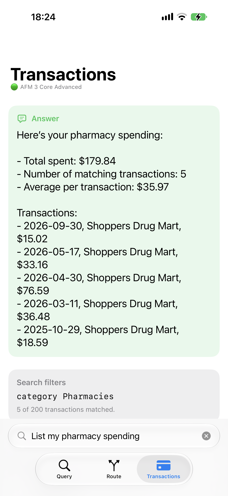
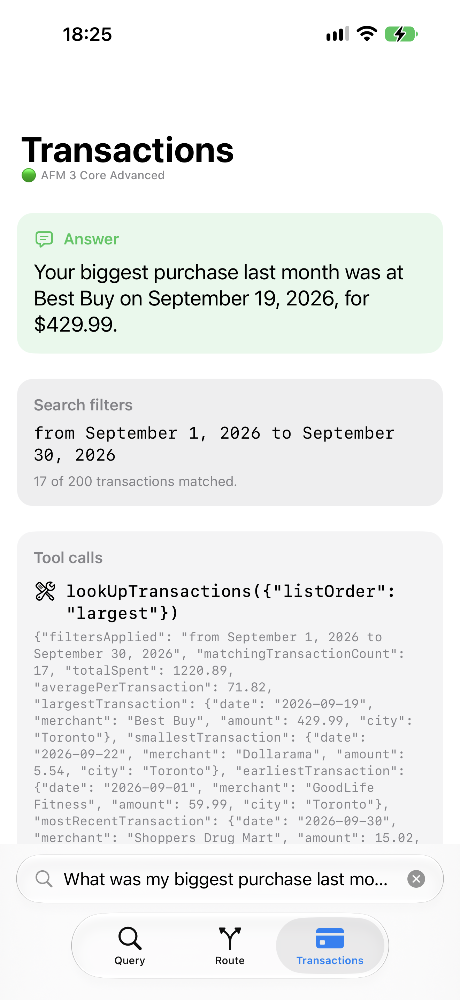

# FoundationModels-Playground

A SwiftUI playground for exploring the capabilities of Apple's on-device Foundation Models.
Demonstrates how on-device AI can understand user requests, interpret natural language queries, and convert them into structured query parameters. Leverages Tool Calling to efficiently filter and analyze large volumes of transaction data.

| **Transaction Search 1** | **Transaction Search 2** |
| :----: | :----: |
|  |  |
